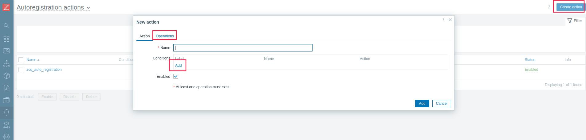

# zabbix-server deploy& zabbix-agent2 config

## zabbix server部署docker-compose命令

```bash
# 创建对应的数据目录，数据保存在本地持久化存储的db_data中
mkdir $PWD/db_data
# 通过docker-compose文件部署zabbix服务
docker-compose up -d
```

**注意：**

1. zabbix server由zabbix web、zabbix server、zabbix java gateway、database server组成，zabbix  web管理界面为8000端口，zabbix-server接收监控信息的接口10051
2. 默认zabbix web界面的用户名和密码是Admin,zabbix
3. mariadb的存储如果为网络存储，则必须注意网络存储的映射权限问题，否则，容易造成数据库初始化失败

## 手动配置zabbix-agent

1、zabbix_agentd.conf 的配置是active 模式,active checks时间间隔设置为60s

```ini
# 编辑
ServerActive=192.168.1.101	# 主动向zabbix服务器发送信息
Hostname=you_server_name	# 修改为对应hostname

```

### 几条配置zabbix-agent配置文件的示例命令：

```
sed -ri 's@^#*\s*ServerActive=\S+@ServerActive=10.6.17.34@' /etc/zabbix/zabbix_agentd.conf
```
设置为主动模式，主动向ip为10.6.17.34的zabbix服务器发送数据并请求需相关监控项

```
sed -ri 's@^#*\s*RefreshActiveChecks=\S+@RefreshActiveChecks=60@' /etc/zabbix/zabbix_agentd.conf
```
设置zabbix-agent主动检测间隔为60s


```
sed -ri 's@(^\s*Hostname=\S+)@#\1@' /etc/zabbix/zabbix_agentd.conf
```
注释掉Hostname字段，这样该主机在zabbix server上显示的名称即为系统配置的hostname（所以不同主机的hostname不要设置一样）

```
sed -ri '/^#\s*UserParameter=.*/a\UserParameter=system.top.mem,top -bn1 -o%MEM | head -20' /etc/zabbix/zabbix_agentd.conf
```
增加自定义key，此key使用top命令按照memory排序进程，并输出top的前20行输出，定义key的格式为
```
UserParameter=<key>,<shell command>
```
或者另外创建一个配置文件，专门用于配置自定义key，例如:

```ini
# /etc/zabbix/zabbix_agent2.d/udcp_check.conf
UnsafeUserParameters=1
UserParameter=self.dns[*],timeout 1 nslookup $1 127.0.0.1 &> /dev/null && echo 'OK' 
UserParameter=self.web[*],curl -iIsLk $1 | grep -o "$2"
UserParameter=self.k8s.node,kubectl get node | grep -qE "$(hostname)\s+Ready\s+" && echo 'OK'
UserParameter=self.pod.total_num,kubectl --kubeconfig /root/.kube/config get pods -A | grep -E '\s([0-9])/\1\s+Running' | wc -l
UserParameter=self.pod.num,kubectl get pod -A -owide | awk '(NR>1){print}'|grep -E '\s([0-9])/\1\s+Running' | grep $(hostname) | wc -l
UserParameter=self.pod.abnormal_num,kubectl get pod -A -owide | awk '(NR>1){print}'|grep -vE '\s([0-9])/\1\s+Running' | grep $(hostname) | wc -l
UserParameter=self.docker.image.num,docker images -q | sort | uniq |wc -l
UserParameter=self.ck[*],clickhouse-client --host=127.0.0.1 --port=8000 --user=$1 --password=$2 -q "$3"| grep -Eo '$4'
UserParameter=self.mariadb[*],mysql -u$1 -p$2  -e "$3"| awk $4
UserParameter=self.redis[*],bash /home/redis_zbx_check.sh '$1' '$2' '$3'
UserParameter=self.gluster[*],gluster $1| grep -o $2 
UserParameter=self.ck.sync,bash /home/check_ck_sync.sh
```

shell command可以是使用绝对路径指定的脚本

## 利用gevent协程+paramiko批量对大量server进行zabbix agent 安装及配置

```bash
cd paramiko
python3 gevent_set_hostsA.py
```

具体脚本内容见对应py脚本

## zabbix web配置思路

1、配置Alerts-->Actions->Autoregistration actions 配置机器自发现，根据相关信息Contditions（例如Hostname中包含字段），将host放入对应的host group或者Add host tags以便之后管理




2、在Data Collection模块，先创建一个Template Groups，再创建Templates，根据需求在Templates中创建Items，可以关联自定义的key监控项

3、手动在Data Collection-->Hosts中执行Mass update，将按条件筛选出来的host关联上指定的templates


4、在dashboard上添加对应的widget

5、示例配置


